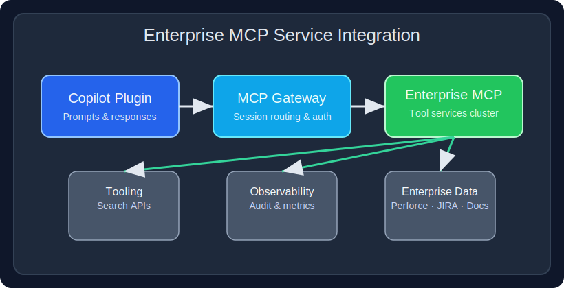
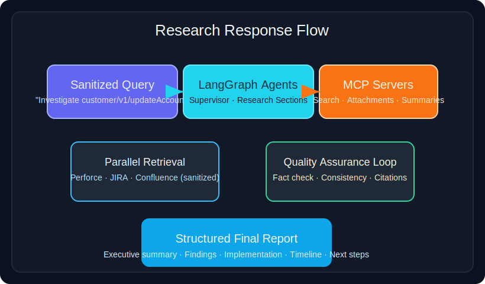

# Enterprise Multi-Agent Research System

[](https://www.python.org/downloads/)
[](https://opensource.org/licenses/MIT)
[](https://langchain.com/)
[](https://github.com/langchain-ai/langgraph)

A production-grade multi-agent AI system for autonomous enterprise research and analysis across distributed data sources. Built with LangGraph and LangChain, this system orchestrates intelligent agents to search, analyze, and synthesize information from Perforce, JIRA, and Confluence.

## 🚀 Features

### Multi-Agent Architecture
- **Supervisor Agent**: Orchestrates research workflow and delegates tasks
- **Research Agents**: Perform parallel deep-dive research on specific sections
- **Graph-based Orchestration**: Dynamic task routing with LangGraph conditional edges
- **State Management**: TypedDict-based state flow with reducers for complex data aggregation

### Enterprise Integration
- **Perforce**: Search changelists, get details, retrieve file content
- **JIRA**: Search issues, get ticket details, track relationships
- **Confluence**: Search documentation, extract page content
- **Cross-Source Analysis**: Correlate data across all three platforms

### Advanced Capabilities
- **Parallel Execution**: Concurrent research across multiple sections
- **MCP Protocol**: Standardized AI-to-tool communication via Model Context Protocol
- **Session Persistence**: Singleton pattern for maintaining tool session state
- **Dynamic Tool Discovery**: Automatic tool registration with conflict resolution
- **Comprehensive Logging**: Detailed tracing for debugging and monitoring

## 📋 Prerequisites

- Python 3.8+
- Ollama installed and running locally
- Access to enterprise systems (Perforce, JIRA, Confluence)
- API credentials for each enterprise system

## 🛠️ Installation

### 1. Clone the Repository
```bash
git clone https://github.com/aimanyounises1/enterprise-multi-agent-research.git
cd enterprise-multi-agent-research
```

### 2. Create Virtual Environment
```bash
python -m venv venv
source venv/bin/activate  # On Windows: venv\Scripts\activate
```

### 3. Install Dependencies
```bash
pip install -r requirements.txt
```

### 4. Set Up Environment Variables
Create a `.env` file in the project root:
```env
# Perforce Configuration
P4PORT=your-perforce-server:port
P4USER=your-username
P4CLIENT=your-client
P4PASSWD=your-password

# JIRA Configuration
JIRA_SERVER=https://your-jira-instance.com
JIRA_USERNAME=your-email@company.com
JIRA_API_TOKEN=your-api-token

# Confluence Configuration
CONFLUENCE_URL=https://your-confluence-instance.com
CONFLUENCE_USERNAME=your-email@company.com
CONFLUENCE_API_TOKEN=your-api-token

# Optional: LangSmith for tracing
LANGSMITH_API_KEY=your-langsmith-key
LANGSMITH_PROJECT=your-project-name
LANGCHAIN_TRACING_V2=true
```

### 5. Download Ollama Model
```bash
ollama pull qwen3:30b-a3b
```

## 🎯 Usage

### Basic Research Query
```python
import asyncio
from src.enterprise_multi_agent import research_with_enterprise_tools

async def main():
    query = "Research VIT-60872 and related MTV2005 implementations"
    
    result = await research_with_enterprise_tools(
        query=query,
        stream_output=True
    )
    
    print(result["final_report"])

asyncio.run(main())
```

### Custom MCP Configuration
```python
custom_config = {
    "enterprise_server": {
        "command": "python",
        "args": ["src/mcp/enterprise_mcp_server.py"],
        "transport": "stdio",
        "env": {
            "P4PORT": "custom-server:1666",
            # ... other custom settings
        }
    }
}

result = await research_with_enterprise_tools(
    query="Your research query",
    mcp_config=custom_config,
    stream_output=True
)
```

### Direct Graph Usage
```python
from src.enterprise_multi_agent import graph
from langchain_core.messages import HumanMessage

initial_state = {
    "messages": [HumanMessage(content="Research query")],
    "original_query": "Research query"
}

config = {
    "configurable": {
        "supervisor_model": "qwen3:30b-a3b",
        "researcher_model": "qwen3:30b-a3b",
        "supervisor_temperature": 0.1,
        "researcher_temperature": 0.2
    }
}

result = await graph.ainvoke(initial_state, config=config)
```

### Slide-Based Secondary Search Scenario
The demo script in `examples/run_examples.py` now includes a `360° Secondary Search Expansion` option inspired by the deep-dive presentation. It issues a sanitized query around `customer/v1/updateAccount`, showcases how secondary identifiers (for example, documentation tasks such as `DOC-1064`) are discovered, and demonstrates how the supervisor and researcher agents collaborate to correlate Perforce changelists, JIRA issues, and Confluence pages.

> All identifiers in this scenario are anonymized placeholders to ensure corporate data remains secure.

### Enterprise MCP Visuals
<p align="center">
  
</p>
<p align="center">
  
</p>

## 🏗️ Architecture

```
┌─────────────────────────────────────────────────┐
│                 Supervisor Agent                 │
│         (Orchestrates Research Workflow)         │
└─────────────┬───────────────────────────────────┘
              │
              ├── Creates Research Sections
              ├── Delegates to Research Agents
              └── Writes Introduction/Conclusion
              
┌─────────────────────────────────────────────────┐
│              Research Agents (Parallel)          │
│         (Deep-dive Research per Section)         │
└─────────────┬───────────────────────────────────┘
              │
              └── Uses Enterprise Tools
              
┌─────────────────────────────────────────────────┐
│                 MCP Server Layer                 │
│            (Enterprise Tool Interface)           │
├──────────────┬──────────────┬──────────────────┤
│   Perforce   │     JIRA     │   Confluence     │
└──────────────┴──────────────┴──────────────────┘
```

## 🔧 Configuration

### Agent Models
Configure models in `src/enterprise_multi_agent/config/agent_config.py`:
- `supervisor_model`: Model for the supervisor agent (default: qwen3:30b-a3b)
- `researcher_model`: Model for research agents (default: qwen3:30b-a3b)
- `supervisor_temperature`: Temperature for supervisor (default: 0.1)
- `researcher_temperature`: Temperature for researchers (default: 0.2)

### Tool Settings
- `max_results`: Adjust search result limits for each tool
- `search_mode`: "comprehensive" or "quick" for Perforce searches
- `include_attachments`: Enable/disable JIRA attachment fetching

## 📊 Example Output

```markdown
# Enterprise Research Report: VIT-60872 Analysis

## Introduction
This report provides a comprehensive analysis of VIT-60872...

## VIT-60872 Details
Based on research from JIRA [Source: JIRA VIT-60872]:
- Status: In Progress
- Priority: High
- Related MTV: MTV2005, MTV2010
...

## Related Perforce Changes
Analysis of code implementations [Source: Perforce CL 27235273]:
- Implementation of feature X
- Bug fixes for component Y
...

## Conclusion
The research reveals that VIT-60872 is a critical issue...
```

## 🧪 Testing

Run the test suite:
```bash
pytest tests/
```

Run specific tests:
```bash
pytest tests/test_supervisor.py -v
pytest tests/test_researcher.py -v
```

## 📝 Documentation

- [Architecture Overview](docs/architecture.md)
- [Enhancement Roadmap](docs/enhancement_roadmap.md)
- [API Reference](docs/api_reference.md)
- [Configuration Guide](docs/configuration.md)
- [Technical Deep Dive Examples](docs/technical_deep_dive_examples.md) ← sanitized scenarios distilled from the presentation
- [Sample Research Session Output](docs/research_sample_output.md)

## 🤝 Contributing

We welcome contributions! Please see [CONTRIBUTING.md](CONTRIBUTING.md) for details.

1. Fork the repository
2. Create your feature branch (`git checkout -b feature/AmazingFeature`)
3. Commit your changes (`git commit -m 'Add some AmazingFeature'`)
4. Push to the branch (`git push origin feature/AmazingFeature`)
5. Open a Pull Request

## 📄 License

This project is licensed under the MIT License - see the [LICENSE](LICENSE) file for details.

## 🙏 Acknowledgments

- Built with [LangChain](https://langchain.com/) and [LangGraph](https://github.com/langchain-ai/langgraph)
- Powered by [Ollama](https://ollama.ai/) for local LLM inference
- MCP Protocol implementation via [FastMCP](https://github.com/mcp/fastmcp)

## 📞 Contact

Aiman Younis - [LinkedIn](https://www.linkedin.com/in/aimanyounis/) - aimanyounises@gmail.com

Project Link: [https://github.com/aimanyounises1/enterprise-multi-agent-research](https://github.com/aimanyounises1/enterprise-multi-agent-research)

---

⭐ If you find this project useful, please consider giving it a star!
