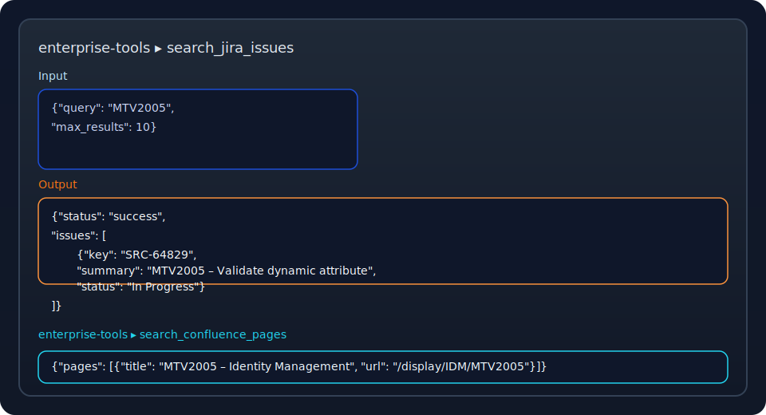

# Sample Research Session Output

This walkthrough demonstrates a sanitized research session produced by the multi-agent workflow. All identifiers, URLs, and names are fictional placeholders aligned with the presentation deck.

## Query

```
Investigate customer/v1/updateAccount:
- Identify related changelists and documentation tasks
- Cross-reference any linked knowledge base items
- Summarize relationships across code, tickets, and docs
```

## Streaming Highlights

1. **Supervisor Agent** breaks the request into:
   - API behavior overview
   - Recent delivery work
   - Knowledge base validation
2. **Research Agents** call the MCP tools (Perforce, JIRA, Confluence) using sanitized identifiers such as `CL-27319`, `DOC-1064`, and `SRC-60899`.
3. **Quality Loop** performs fact-checking and consistency scoring before the report is finalized.



> **Figure 1.** Mock capture of the MCP tool responses using sanitized placeholders.

## Final Report (Excerpt)

### Executive Summary
- The endpoint `customer/v1/updateAccount` is owned by the **Identity Management Platform** team.
- Latest delivery work completed in `CL-27319` for sprint `Q2S4`, introducing dynamic account attribute validation.
- Documentation task `DOC-1064` contains deployment prerequisites and rollback strategy.

### Detailed Findings
- **Perforce**: Changelist `CL-27319` modifies `account_service.py` and updates integration tests. Linked to ticket `SRC-60899`.
- **JIRA**: Ticket `SRC-60899` tracks the fallback patch for paper statements. Status `In Progress`; target release `2025.06`.
- **Confluence**: Page `DOC-1064` ("Identity Management – Login with SSO") documents the dependency on the unified customer schema and includes configuration matrices.

### Technical Implementation
- REST validation handled in `validate_update_request()` with new guard `is_dynamic_attribute_supported`.
- Feature flag `customer-update-dynamic` toggles the new flow for pilot markets.
- Alerting hooks added to `identity-metrics` dashboard for error rate monitoring.

### Timeline & History
- `2025-05-04`: Ticket `SRC-60899` created with reproduction steps.
- `2025-05-09`: Changelist `CL-27319` merged following peer review.
- `2025-05-10`: Documentation `DOC-1064` updated with deployment checklist.

### Recommendations
1. Promote the feature flag to 50% rollout once automated regression passes in staging.
2. Schedule a follow-up review with the data governance group for attribute catalog alignment.
3. Capture additional metrics for failed login attempts tied to the new validation path.


> **Figure 2.** Visual summary of the sanitized report generated by the agents.

---

To reproduce this example locally, run `python examples/run_examples.py` and choose **"360° Secondary Search Expansion"**. Ensure your `.env` points to non-production sandbox systems when experimenting.
