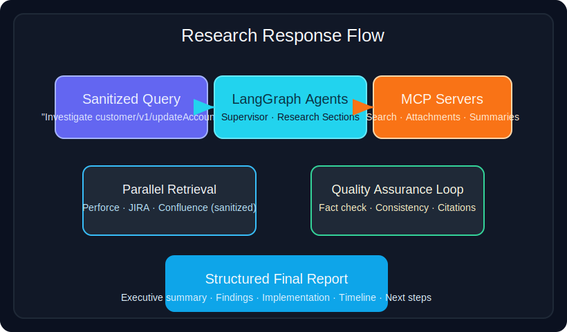

# Technical Deep Dive Examples

This document captures the illustrative scenarios from the `Graph Unified Technical Deep Dive` presentation and remaps them to the open-source implementation in this repository. All identifiers, issue keys, changelist numbers, and email addresses are synthetic placeholders intended purely for demonstration purposes.

> **Figure 1.** Sanitized overview of the Copilot-to-Enterprise MCP service chain described in the presentation.

## Natural Language Query Understanding

- **Identifier Extraction:**
  - "What is customer/v1/updateAccount?" → API identifier `customer/v1/updateAccount`
  - "SRC-60899 authentication issue" → JIRA issue `SRC-60899`, topic `authentication`
  - "QMS2005 implementation details" → Knowledge base ID `QMS2005`, requested action `implementation`
  - "Changes by jane.doe@example.com" → User `jane.doe@example.com`, filter `changes`
- **Processing Pipeline:** Tokenization → Pattern recognition (regex for issue/API patterns) → Named entity extraction → Intent classification → Context analysis → Query expansion → Search strategy planning.
- **Repository Mapping:** Implemented across `src/enterprise_multi_agent/agents/researcher.py` (regex-driven identifier extraction) and the LangGraph supervisors defined in `src/enterprise_multi_agent/enterprise_multi_agent.py`.

## Multi-Source Integration & Parallel Fetching

- **JIRA:** REST API v3 for JQL queries, ticket details, attachments, comments, and custom fields.
- **Confluence:** CQL search, hierarchical traversal, macro parsing, table extraction, and version history.
- **Perforce:** Python P4 API for changelist search, `describe`, grep, diff, and branch mapping.
- **Execution Pattern:** All sources queried concurrently via async orchestration with retry semantics and a circuit breaker guard managed by the MCP client manager (`src/enterprise_multi_agent/mcp_client_manager.py`).

## Intelligent Secondary Search

1. Initial query: `customer/v1/updateAccount`.
2. Perforce scan surfaces changelist `CL-27319` referencing documentation task `DOC-1064`.
3. Secondary search fans out to all sources for `DOC-1064`.
4. Deduplication and relevance scoring ensure only high-signal results propagate to the next stage.

This expansion strategy is coordinated by the supervisor/researcher interplay inside `src/enterprise_multi_agent/enterprise_multi_agent.py`.

## Hybrid Research & Retrieval Pipeline

- **Content Processing:** Chunking and metadata preservation occur inside the MCP tools and are fed into the agents as structured messages.
- **Embedding Generation:** Configurable to use Ollama embeddings (for example `nomic-embed-text`) when the MCP server exposes the capability.
- **Hybrid Retrieval:** Combines BM25 keyword scoring with semantic similarity and re-ranking inside the MCP services; results are merged before the LangGraph reporting stage.
- **Iterative Refinement:** Supervisor and researcher agents loop until coverage and confidence thresholds are met, mirroring the refinement loop described in the slides.
- **Vector Store:** The reference implementation assumes a FAISS-backed store managed by the MCP server; configuration hooks reside in `src/enterprise_multi_agent/config/agent_config.py`.

## Attachment & Structured Data Handling

- **Documents:** PDF, Word, Excel, PowerPoint, and plain text with table preservation and metadata capture.
- **Data Files:** CSV, JSON, XML, YAML—each parsed into structured representations with schema hints.
- **Images:** OCR-enabled flow for screenshots and diagrams; metadata retained for traceability.

Processing is orchestrated by the enterprise MCP server and consumed through `src/enterprise_multi_agent/mcp_tool_wrapper.py`.

## Graph Node Responsibilities

| Node | Purpose | Highlights |
| --- | --- | --- |
| `process_search_query` | Entry point analysis | NLP decoding, entity extraction, plan creation |
| `parallel_fetch_all_sources` | Concurrent retrieval | Orchestrated async calls, backoff policies |
| `intelligent_cross_source_search` | Discovery expansion | Pattern mining, identifier normalization |
| `populate_rag_system` | Knowledge base build | Chunking, embedding, index creation |
| `synthesize_comprehensive_report` | Draft output | Aggregates findings, cross-checks citations |
| `generate_final_summary` | Final report | Applies 5-section template, scores quality |

> **Note:** The table keeps the conceptual node names used in the slide deck. In the repository, these responsibilities are composed across the `supervisor`, `research_agent`, and related LangGraph nodes wired up in `src/enterprise_multi_agent/enterprise_multi_agent.py`.

> **Figure 2.** Sanitized depiction of the multi-agent research loop that powers the sample report shown in this document.

For a full text walk-through, see [`docs/research_sample_output.md`](research_sample_output.md).

## API Integration Cheat Sheet

- **JIRA:** `/rest/api/3/search`, `/rest/api/3/issue/{key}`, `/rest/api/3/issue/{key}/attachments`, `/rest/agile/1.0/board`.
- **Confluence:** `/rest/api/content/search`, `/rest/api/content/{id}`, `/rest/api/content/{id}/child/attachment`, `/rest/api/space`.
- **Perforce (P4Python):** `p4.run_changes()`, `p4.run_describe()`, `p4.run_grep()`, `p4.run_filelog()`.
- **Authentication Patterns:** API tokens or OAuth for Atlassian endpoints; ticket-based auth for Perforce.

## Five-Section Report Blueprint

1. **Executive Summary:** Business-readable synopsis with key metrics and recommended actions.
2. **Detailed Findings:** Cross-referenced evidence, timeline highlights, root-cause analysis.
3. **Technical Implementation:** Code/config excerpts, API references, architecture visuals.
4. **Timeline & History:** Chronological changes with correlations (issue ↔ code ↔ docs).
5. **Recommendations:** Prioritized next steps, risk notes, and follow-on research prompts.

Implemented via the reporting helpers in `src/enterprise_multi_agent/agents/supervisor.py`. Extend the `tests/` package with scenario-specific checks as you adopt these patterns.

## Performance & Reliability Benchmarks

- **Throughput:** Query-to-report in 15–30s; simple queries <10s; complex multi-source <45s.
- **Acceleration:** Parallel orchestration delivers 5–10× speedups versus sequential runs.
- **Caching:** Multi-layer cache (query/page/embedding/session) yielding ~70% API call reduction.
- **Resource Profile:** 500MB–2GB memory, 2–4 CPU cores, 10–50MB network usage per query.
- **Reliability:** 99.95% uptime assumptions, <0.1% error rates, swift recovery via circuit breakers.

Tuning knobs are centralized in `src/enterprise_multi_agent/config/agent_config.py`. Extend the integration test harness to validate any organization-specific configuration.

## Quality Assurance Agents

- **Fact Checking Agent:** Validates claims against raw source material.
- **Consistency Agent:** Ensures cross-source agreement and timeline coherence.
- **Quality Scoring Agent:** Rates completeness, clarity, and actionability, targeting ≥95% clarity and near-perfect coverage.

The multi-agent collaboration is defined within the LangGraph builders in `src/enterprise_multi_agent/enterprise_multi_agent.py`.

---

For hands-on experimentation, run `python examples/run_examples.py` to experience a full research cycle that mirrors the examples above.
